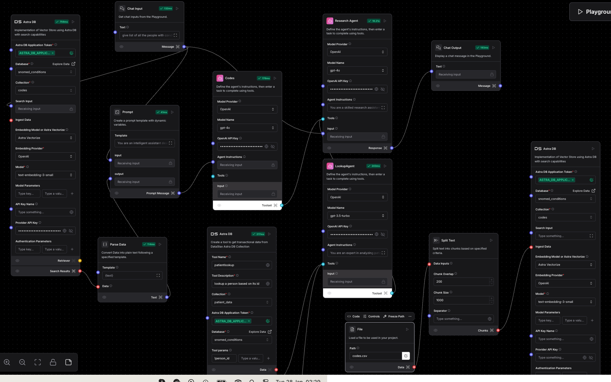
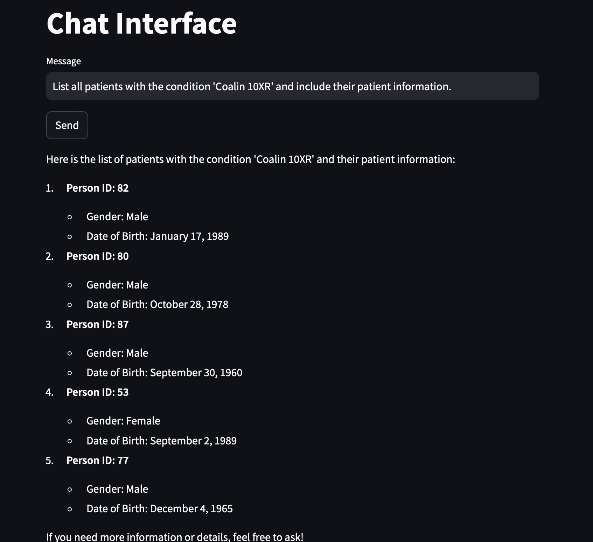

# Business-Specific RAG Chat Interface  
*Built with LangFlow & DataStax Astra DB*  

---

## 📖 Overview  
This project uses **LangFlow** and **DataStax Astra DB** (vector database) to create a secure RAG system for querying proprietary or internal data. Designed for:  
- Querying using data **not exposed to public AI models**.  
- **Custom synonym/term mapping**
- **API integration** for chat-style responses.  

---

## ✨ Key Features  
- **Visual RAG Pipeline**: Designed in LangFlow with hybrid search (vector + keyword).  
- **Astra DB Integration**: Securely stores vectorized data for similarity searches.  
- **Business Glossary Support**: Map internal terms to standardized descriptions.  

---

## 🧠 Technical Flow  
1. **Data Ingestion**:  
   - Upload internal documents (PDFs, CSVs) to LangFlow to describe the company specific data.  
   - Define synonyms/metadata for domain-specific terms.  

2. **Vectorization**:  
   - Critical data fields are vectorized and stored in **Astra DB**.  

3. **Query Handling**:  
   - Natural language queries → Hybrid search in Astra DB → Context-aware responses via API.  

----

## 🎥 Demo: Using Custom Medical Terms to Query Patient Data  

### **Example**  
- **Custom Term**:

| Local Term    | Description                                                               |
| ------------- | ------------------------------------------------------------------------- |
| Coalin 10XR   | Narrowing of the pylorus (stomach outlet) due to scarring or inflammation.|

- **RAG Data**: Patient records split across tables (`patients`, `conditions`, `visits`), with **only condition names vectorized**. The terminologies in these databases are standard.  

- The terms are intentionally random and meaningless to ensure results come solely from RAG, not LLM knowledge.

**User Query**:  

### **Workflow**  
  

### **Chat Interface**  
  
